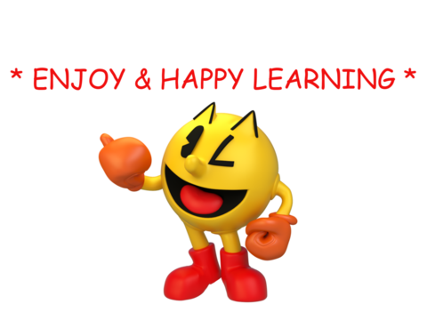

# RMIT COSC3117/1127 AI'26 - Project 0 - Python

You must read fully and carefully the assignment specification and instructions detailed in this file. You are NOT to modify this file in any way.

* **Course:** [COSC3117/1127 Artificial Intelligence](https://handbook.rmit.edu.au/ords/r/rmit/catalogue/course?p6_code=004123&clear=6) @ Semester 2, 2026
* **Instructor:** Prof. Sebastian Sardina
* **Deadline:** Sunday July 26th, 2026 @ 11:59pm (end of Week 1)
* **Course Weight:** 1%
* **Assignment type:**: Individual
* **CLOs:** None (it is a refresh of Python/Unix)
* **Submission method:** in git via tagging (see below for instructions)

The **purpose** of this project is to refresh (or learn) the basics of Python and Unix-based system, and to get used to the development and submission of the practical assessments in the course.

<p align="center">
    
        
</p>

> [!IMPORTANT]  
> 
> **About this repo:** You must ALWAYS keep your fork **private** and **never share it** with anybody in or outside the course, _even after the course is completed_. You are not allowed to make another repository copy outside the provided GitHub Classroom without the written permission of the teaching staff. Please respect the authors request:
> 
> > **_Please do not distribute or post solutions to any of the projects._**
> 

<br>

- [RMIT COSC3117/1127 AI'26 - Project 0 - Python](#rmit-cosc31171127-ai26---project-0---python)
  - [Marking criteria ✅](#marking-criteria-)
  - [Your task 🫵 👷‍♀️](#your-task--️)
    - [Question 1: Addition](#question-1-addition)
    - [Question 2: `buyLotsOfFruit` function](#question-2-buylotsoffruit-function)
    - [Question 3: `shopSmart` function](#question-3-shopsmart-function)
  - [Submission Instructions 📨](#submission-instructions-)
  - [Important information ❗](#important-information-)
  - [AI Code of Honour  🥇](#ai-code-of-honour--)
  - [Final Words... 🏁](#final-words-)
  - [Acknowledgements 🙏](#acknowledgements-)


## Marking criteria ✅

We will follow the weights specified in each task, and also consider the development quality for evidence of sustainable work towards the solution (not just the solution); see below. A feedback autograder is provided, but you should consider it as a **feedback** tool (i.e., a useful indication of your performance) and not as the ultimate mark. We reserve the right to run more tests, inspect your code and repo manually, and arrange for a face-to-face meeting for a discussion and demo of your solution if needed.

You must also **follow good SE practices**, including good use of git version control during your development such as:

* _Commit early, commit often:_ it is not good practice to make a single commit with all of the solution nor is it good practice to make very few commits each with big chunks of it.
* _Use meaningful commit messages:_ like comments in your code, the message should clearly summarise what the commit is about. Messages like "fix", "work", "commit", "changes" are poor and do not help us understand what was done.
* _Use atomic commits:_ avoid commits doing many things; let alone one commit solving many questions of the project. Each commit should be about one (little but interesting) thing. 

You must adhere to the [SE and GIT Best Practices][SEGIT]; the document also has examples of quality development. 😉

> [!CAUTION]
> We will inspect the **commit history** for high-quality SE practices and evidence of _meaningful contributions_ 👌. The results of this check can affect the overall mark of the project and point deductions/weighting may be applied when poor SE practices have been used or no evidence of contributions and/or process can be found. For example, few commits with a lot of code changes, commits mixing different aspects (e.g., commits across different questions), poor non-meaningful commit messages (e.g., "update" or "changes"), file uploads, or unnecessary many commits may result in deductions, _even if the performance is excellent_. The commit history needs to provide evidence how you worked towards your solution; the process. A single or very few bulk commits (which does not provide evidence of process and progress), will attract at most 20% of the overall marks. 

## Your task 🫵 👷‍♀️

In this assessment, **your task** is to complete the exercises from the UC Berkeley Pacman Projects, as listed below.

* ✅ You **must build and submit your solution** using the sample code we provide you in this repository, which is different from the original UCB code base. 

* 👀 You should **only work and modify** files `addition.py`, `buyLotsOfFruit.py`, and `shopSmart.py` in doing your solution. Do not change the other Python files in this distribution.

* 💻 Your code **must run _error-free_ on Python 3.9+**. Staff will not debug/fix any code. Using a different version will risk your program not running with the Pacman infrastructure or autograder and may risk losing (all) marks. See also [these questions](https://github.com/RMIT-COSC1127-3117-AI/AI26-DOC/blob/main/FAQ-PROJECTS.md#what-version-of-python-should-i-use) in the FAQ for more info.

* 🕛 Your solutions must run in **reasonable time** . When a question times out, zero marks will be awarded to the question. Consider that running the whole feedback autograder provided takes less than 0.5 seconds in total (i.e., all tests) in our cluster machines used for marking (not really fast CPUs), and less than 7 seconds on the full marking tests (which includes many other additional test cases).

* ⛔ You should **never tamper with the Pacman infrastructure**, neither at the source code level (e.g., changing files other than the ones for the task) nor at the run-time level (e.g., changing infrastructure properties or catching all exceptions with bare `except:` code). Check [this](https://github.com/RMIT-COSC1127-3117-AI/AI26-DOC/blob/main/FAQ-PROJECTS.md#can-i-change-the-pacman-infrastructure-at-run-time) and [this](https://github.com/RMIT-COSC1127-3117-AI/AI26-DOC/blob/main/FAQ-PROJECTS.md#can-i-use-catch-all-exceptions-in-my-code-or-exceptions-from-the-infrastructure) questions in the FAQ on this and ask if in doubt.

* 👍 You **must follow good SE practice** during you development; please refer to marking criteria below.

* 🏁 A **feedback autograder** is provided which includes some basic core tests (more will be run at marking time, refer to Marking Criteria below). You are free (and encouraged!) to **add additional testing scenarios** under the `test_case/` folder.

* ✉️ You must submit as per instructions below.

### Question 1: Addition

Open `addition.py` and look at the definition of add:

```python
def add(a, b):
    "Return the sum of a and b"
    "*** YOUR CODE HERE ***"
    return 0
```

The tests called this with a and b set to different values, but the code always returned zero. Modify this definition to read:


```python
def add(a, b):
    "Return the sum of a and b"
    print("Passed a = %s and b = %s, returning a + b = %s" % (a, b, a + b))
    return a + b
```

Now run the autograder omitting the results for questions 2 and 3 as follows:

```python
$ python autograder.py -q q1
```

You should be getting full marks for question 1. 👏 


### Question 2: `buyLotsOfFruit` function

Implement the `buyLotsOfFruit(orderList)` function in `buyLotsOfFruit.py` which takes a list of `(fruit,numPounds)` tuples and returns the cost of your list. If there is some fruit in the list which doesn’t appear in `fruitPrices` it should print an error message and return None. Please do not change the `fruitPrices` variable.

Run `python autograder.py` until question 2 passes all tests and you get full marks. Each test will confirm that `buyLotsOfFruit(orderList)` returns the correct answer given various possible inputs. For example, `test_cases/q2/food_price1.test` tests whether:

```
Cost of [('apples', 2.0), ('pears', 3.0), ('limes', 4.0)] is 12.25
```

### Question 3: `shopSmart` function

Fill in the function `shopSmart(orderList,fruitShops)` in `shopSmart.py`, which takes an orderList (like the kind passed in to `FruitShop.getPriceOfOrder`) and a list of `FruitShop` and returns the `FruitShop` where your order costs the least amount in total. Don’t change the file name or variable names, please. Note that we will provide the `shop.py` implementation as a “support” file, so you don’t need to submit yours.

Run `python autograder.py` until question 3 passes all tests and you get full marks. Each test will confirm that `shopSmart(orderList,fruitShops)` returns the correct answer given various possible inputs. For example, with the following variable definitions:

```python
orders1 = [('apples', 1.0), ('oranges', 3.0)]
orders2 = [('apples', 3.0)]
dir1 = {'apples': 2.0, 'oranges': 1.0}
shop1 =  shop.FruitShop('shop1',dir1)
dir2 = {'apples': 1.0, 'oranges': 5.0}
shop2 = shop.FruitShop('shop2', dir2)
shops = [shop1, shop2]
```

Learn how tests are done (may come useful for next Project!) 😉

* `test_cases/q3/select_shop1.test` tests whether: `shopSmart.shopSmart(orders1, shops) == shop1`
* `test_cases/q3/select_shop2.test` tests whether: `shopSmart.shopSmart(orders2, shops) == shop2`

## Submission Instructions 📨

To **submit your assignment** you must complete the following steps:

1. Check that your solution runs error-free on Python 3.8+.
2. Tag the commit you want to be graded with tag `submission` (case sensitive) in the `main` remote branch.
    * The commit and tagging should be dated _before_ the deadline to avoid any late penalty.
    * Make sure your submission is merged into the `main` branch, which should contain your latest stable version.
    * Make sure you _push_ the tag to the _remote_ repo.
    * Note that a _tag_ is a name given to a specific commit in your git history. It is  NOT a branch nor a commit message nor a release. If you create a branch, release, or commit message with the text "`submission`", that will not be counted as tags and no marking will be done.
    * For more info on (re)tagging, please read [this](https://github.com/RMIT-COSC1127-3117-AI/AI26-DOC/blob/main/FAQ-PROJECTS.md#how-do-i-submit-my-project-solution-in-my-git-repository) and [this](https://github.com/RMIT-COSC1127-3117-AI/AI26-DOC/blob/main/FAQ-PROJECTS.md#how-do-i-change-the-submission-tag-if-i-have-already-tagged-one-commit-for-submission) in the FAQ.
4. Fill the [Project 0 Certification Form][CERTFORM].
   * You will need to sign in with a Google account, so that the response can be forwarded to you for your records and to save your answers as you fill it (just in case...). You can use your RMIT Google account or your private one. 
     * If you use your private account, we will link it to your student number, so please make sure you keep using the same email over the course.
   * You will get an email receipt after submitting the certification; please check it and keep it for your records.
   * Non-certified submissions will not be marked and will attract zero marks.

Your code **must run** error-free on Python 3.8+.

> [!CAUTION]
> Submissions not compatible with the instructions above (including missing certification) will attract zero marks and do not warrant a re-submission. Staff will not debug or fix your submission. Read carefully and ask for help (in forum or drop-in lab) if needed.

## Important information ❗

**Corrections:** From time to time, students or staff find errors (e.g., typos, unclear instructions, etc.) in the assignment specification. In that case, a corrected version of this file will be produced, announced, and distributed for you to commit and push into your repository.  Because of that, you are NOT to modify this file in any way to avoid conflicts.

**Late submissions & extensions:** A penalty of 10% of the maximum mark per calendar day will apply to late assignments; see [this question][LATE] in the course FAQs. Extensions will only be permitted in _exceptional_ circumstances; see [this][EXTENSION1] and [this][EXTENSION2] questions in the course FAQs.

**Forum postings:** Do not ever post any information on the forum that may disclose how to solve a question or what the solution may be. You can only post assignment related questions for _clarification_ on what is being asked, for auxiliary programming tasks (e.g., how to sort a list of numbers in Python), or for generic issues and problems with the techniques studied in the course. Posts  discussing possible solutions or strategies may directly be considered plagiarism, see above. If in doubt, do not post and ask your question to the lecturer or tutor instead (remember EdStem allows private posting).

**Academic Dishonesty:** Being an advanced course, we expect full professionalism and ethical conduct. 
Most students know the difference between helping others in their learning and cheating (or helping to cheat). Plagiarism is cheating, and is a serious offence. Please **don't let us down and risk our trust**. You must write your solutions by yourself in full. We trust you will do; again, don't let us down. Once turst is broken, it is very hard to recover. If you nonetheless cheat and break our trust, we will pursue the strongest consequences available to us according to the **University Academic Integrity policy**. In a nutshell, **never look at solution done by others**, either in (e.g., classmate) or outside (e.g., web) the course: **they have already done their learning, this is your opportunity!** If you refrain from this behavior, you are safe. Please make sure you read in full our  [Academic Integrity FAQ](https://github.com/RMIT-COSC1127-3117-AI/AI26-DOC/blob/main/ACADEMIC_INTEGRITY.md) and the entry [In a code assignment/project, how do I make sure I do not go against academic integrity?](https://github.com/RMIT-COSC1127-3117-AI/AI26-DOC/blob/main/CODE-INTEGRITY.md)

**We are here to help!:** We are here to help you! But we don't know you need help unless you tell us. We expect reasonable effort from your side, but if you get stuck or have doubts, please seek help. We will run **drop-in lab sessions** to support these projects, so use them! While you have to be careful to not post spoilers in the forum, you can always ask general questions about the techniques that are required to solve the projects. If in doubt whether a questions is appropriate, post a *Private* post to the instructors (the instructs may make it public if they consider it safe).

**Silence Policy:** A silent policy will take effect **48 hours** before this assignment is due. This means that no question about this assignment will be answered, whether it is asked on the newsgroup, by email, or in person. Use the last 48 hours to wrap up and finish your project quietly as well as possible if you have not done so already. Remember it is not mandatory to complete the project by reaching a perfect state, try to cover as much as possible. By having some silence we reduce anxiety, last minute mistakes, and unreasonable expectations on others.

## AI Code of Honour  🥇

We expect every RMIT student taking this course to adhere to it **Code of Honour** under which every learner-student should:

* Submit their own original work.
* Do not share answers with others.
* Report suspected violations.
* Engage in any other activities that will dishonestly improve their results or dishonestly improve or damage the results of others.

Unethical behaviour is extremely serious and consequences are painful for everyone. We expect enrolled students/learners to take full **ownership** of your work and **respect** the work of teachers and other students.

I hope you enjoy the project and learn from it, and if you still have doubts about the assignment and/or this specification do not hesitate to ask in the [ED discussion Forum][EDSTEM] and we will try to address it as quickly as we can!

## Final Words... 🏁

After completing this project you should have brushed up your Python, Git, and GitHub skills, as well as learnt about the development and submission process for the course projects. You should also now understand the expectations around the projects in the course.

**I hope you enjoy the project and learn from it**, and if you still **have doubts about the project and/or this specification** do not hesitate asking in the [EdStem Course Discussion Forum][EDSTEM] and we will try to address it as quickly as we can!

<p align="center"> 
    
</p>

## Acknowledgements 🙏

This codebase released is on _Project 0 - Tutorial Unix/Python_ from the set of UC Pacman Projects. We are very grateful to UC Berkeley CS188 for developing and sharing their system with us for teaching and learning purposes. 🙏


[SEGIT]: https://github.com/RMIT-COSC1127-3117-AI/AI26-DOC/blob/main/SE-PRACTICES.md
[EDSTEM]: https://edstem.org/au/courses/29086/discussion
[EXTENSION1]: https://github.com/RMIT-COSC1127-3117-AI/AI26-DOC/blob/main/FAQ-COURSE.md#can-i-get-an-extension-for-the-assessment
[EXTENSION2]: https://github.com/RMIT-COSC1127-3117-AI/AI26-DOC/blob/main/FAQ-COURSE.md#i-am-very-busy-with-other-commitments-work-other-subjects-travel-etc-and-may-not-be-able-to-make-the-deadline-can-i-get-an-extension
[LATE]: https://github.com/RMIT-COSC1127-3117-AI/AI26-DOC/blob/main/FAQ-COURSE.md#can-i-submit-late-what-is-the-penalty

[CERTFORM]: https://forms.gle/RAgfYvQktptVifjE7